

	

<h1>2016级项目实训成果展示</h1>
<h2>《家教帮》- HTML5与移动互联网开发</h2>
<h3>Github</h3>
<ul><li>https://github.com/liqilin1996/ruanjiangongcheng</li></ul>
<h3>项目简介</h3>
<body>
    
    现如今，很多大学生都从事家教兼职的工作，我们的项目是专注服务于当代大学生的app，所
以，我们组的项目是做一个家教App，名称为<em>WKTutor</em>。

    这个App的功能是创造一个找家教和做家教并存的平台，学生可以在这个平台上寻找自己需要的
家教课程和家教老师，同样老师也可以在此平台上发布自己的信息，创建自己的家教窗口，供需要的学生自主选择。此App支持线上视频教学，更加方便。

    <em>WKTutor</em>的教学区分为小学、初中、高中、大学，覆盖各个学习阶段，并按城市进行分类，能
让更多的学生找到自己需要的家教内容。除了实时教学外，该App还含有视频教学区，可以随时随地
观看名师教学视频，而且还有名师教学笔记，方便学生课后复习。课后还可以对教师进行教学评价，方便对教师进行管理，也方便学生按需选择。

<h3>项目成员</h3>
<ul>
	<li>张胜然（项目经理，代码开发）
		<ul>
			<li>电子邮箱:<a href="#">1286693585@qq.com</a></li>
			<li>github地址:https://github.com/zhangshengran</li>
		</ul>
	</li>
	<li>杨茜（前端开发）
		<ul>
			<li>电子邮箱:<a href="#">2462006777@qq.com</a></li>
			<li>github地址:https://github.com/yangxi1998</li>
		</ul>
	</li>
	<li>郭艳霞（前端开发）
		<ul>
			<li>电子邮箱:<a href="#">2537158536@qq.com</a></li>
			<li>github地址:https://github.com/guoyanxia</li>
		</ul>
	</li>
	<li>卜冬晓（数据库设计）
		<ul>
			<li>电子邮箱:<a href="#">1165140257@qq.com</a></li>
			<li>github地址:https://github.com/bodongxiao</li>
		</ul>
	</li>
	<li>李其林（前端UI设计）
		<ul>
			<li>电子邮箱:<a href="#">1819755585@qq.com</a></li>
			<li>github地址:https://github.com/liqilin1996</li>
		</ul>
	</li>
	<li>张宁（后端开发）
		<ul>
			<li>电子邮箱:<a href="#">zn993160060@icloud.com</a></li>
			<li>github地址:https://github.com/zn1121</li>
		</ul>
	</li>
	<li>迟国强（文档编写）
		<ul>
			<li>电子邮箱:<a href="#">255177826@qq.com</a></li>
			<li>github地址:https://github.com/0214Chi</li>
		</ul>
	</li>
</ul>
<h3>功能实现</h3>
<ol>
	<li>在线找家教联系老师下订单：学生点击教师推荐/搜索教师/热门课程——>点击联系教师/直接下单——>填写上课时间上课地点——>下单</li>
	<li>发布社区动态:用户点击首页社区查看更多——>点击加号——>发表图片文字</li>
	<li>学习圈资料共享:用户点击学习圈——>点击资料云——>下载资料</li>
	<li>在线视频学习:用户点击学习圈——>点击视频观看视频</li>
</ol>
<h3>用户体验</h3>
	学生老师登录
	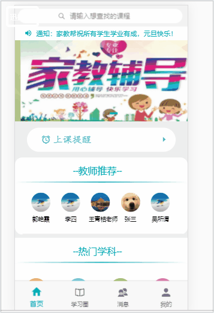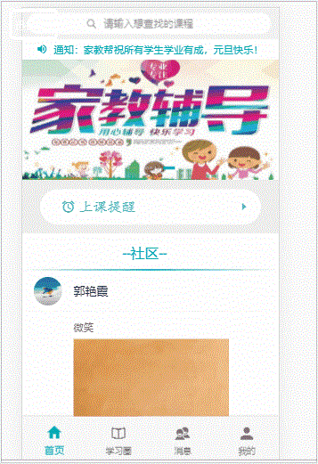
<h3>页面展示</h3>
	<h4>学生模块</h4>		
	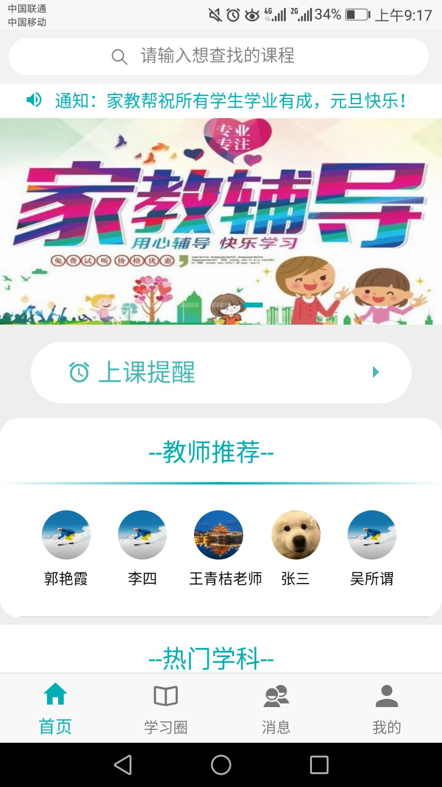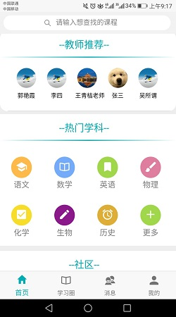
	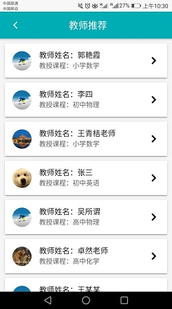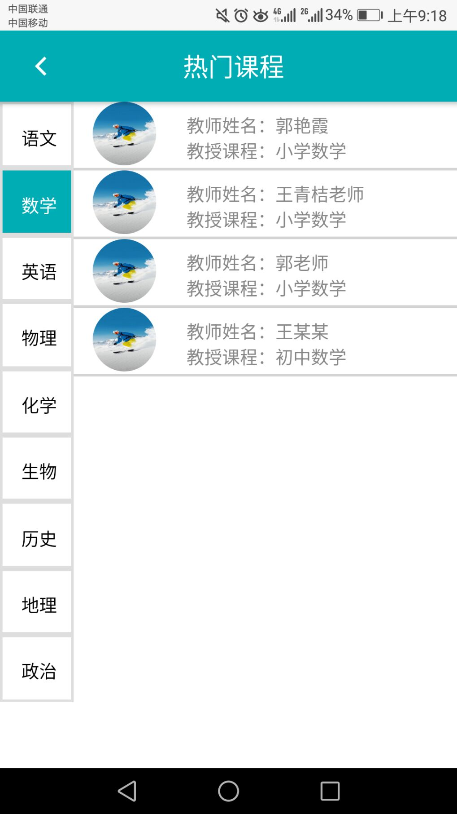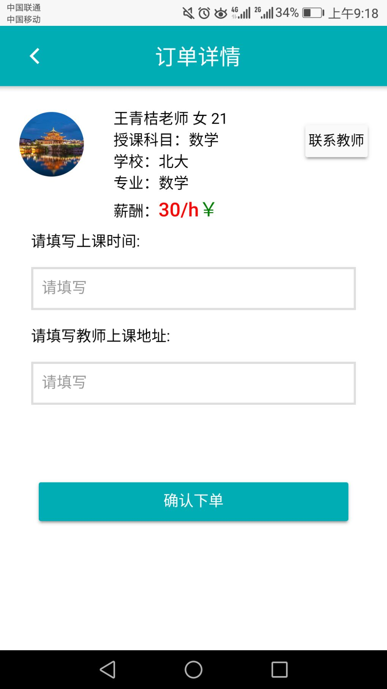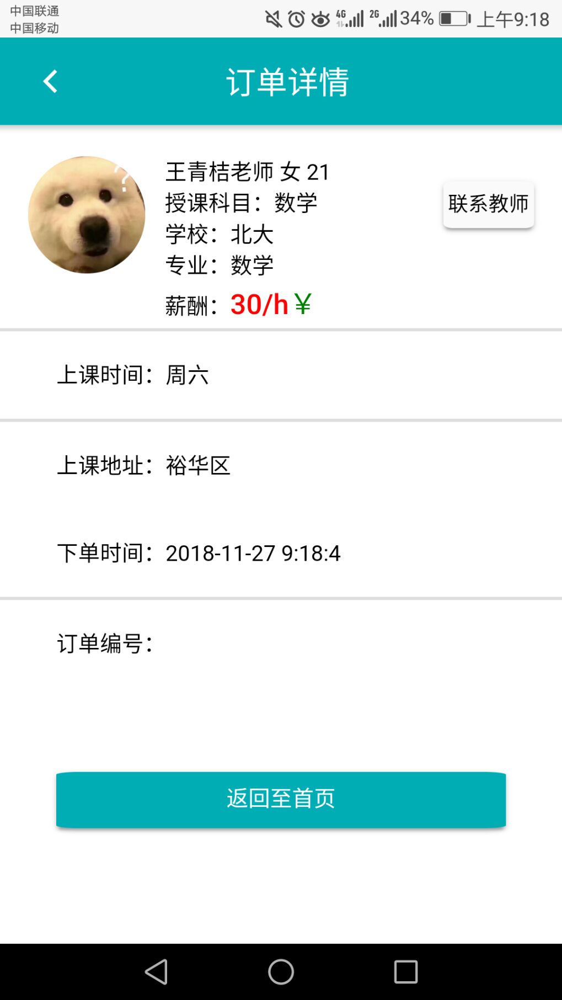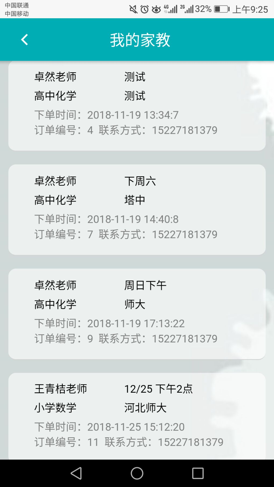
	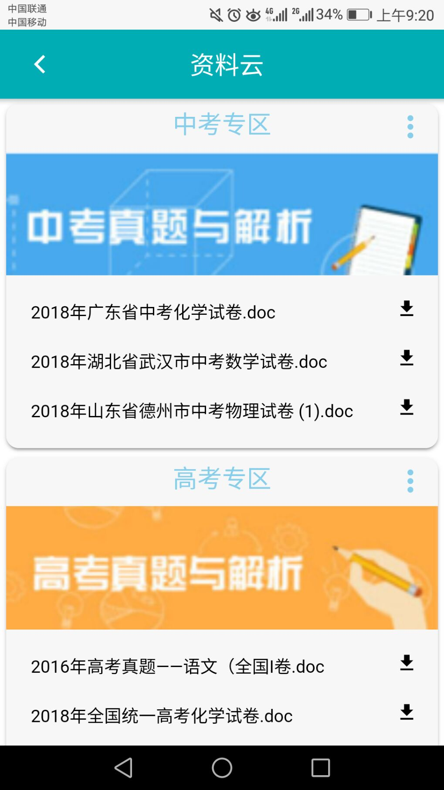
	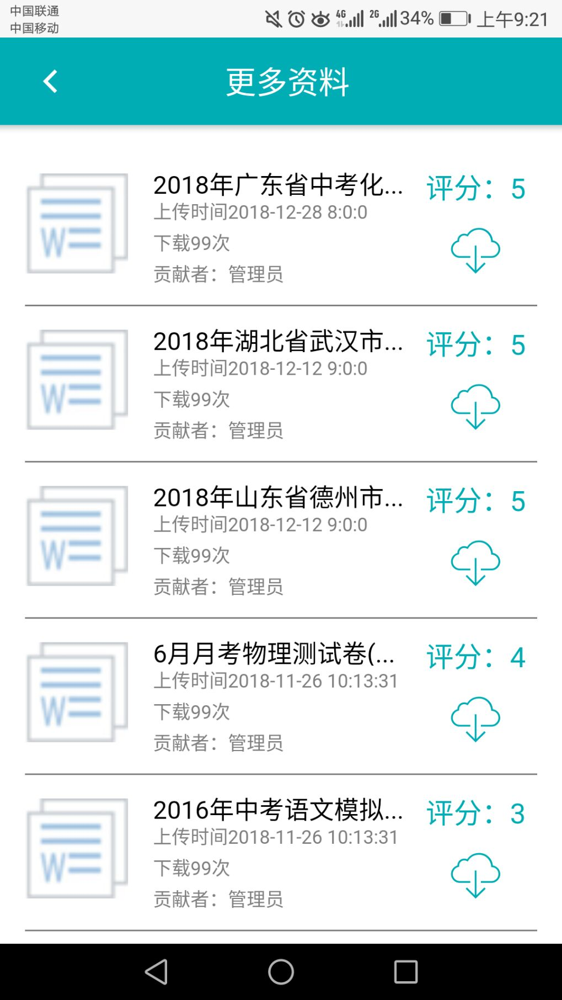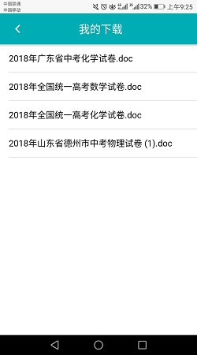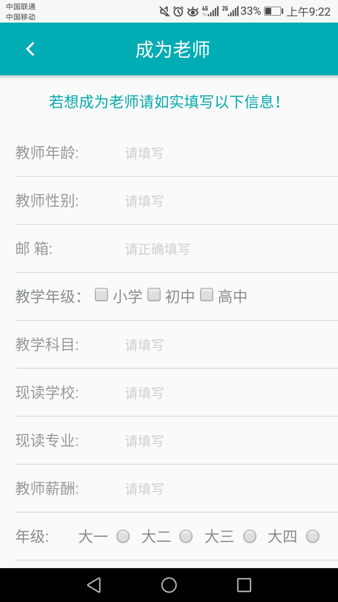
	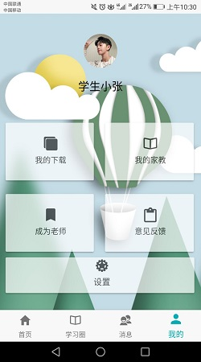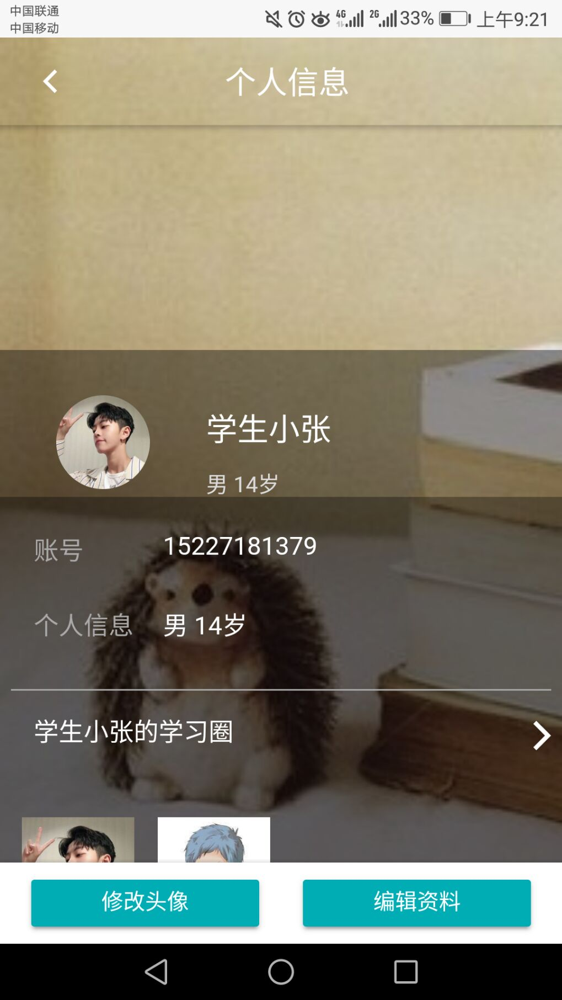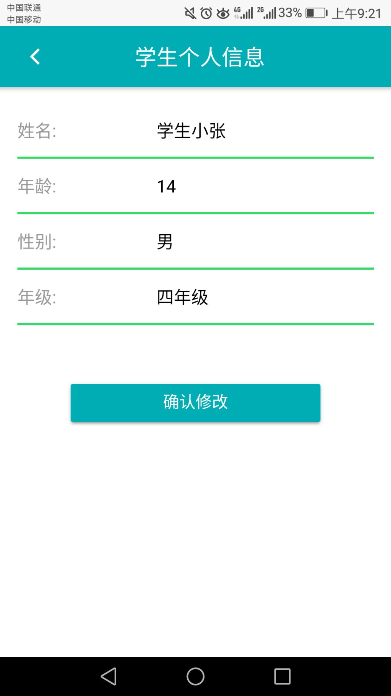
	<h4>老师模块</h4>	
	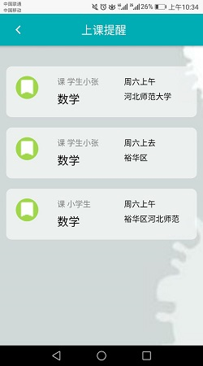
	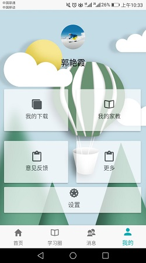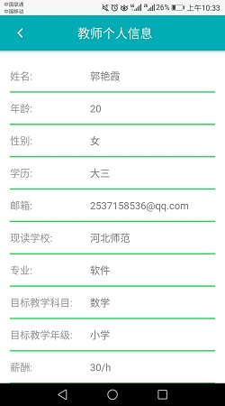
	

</body>
